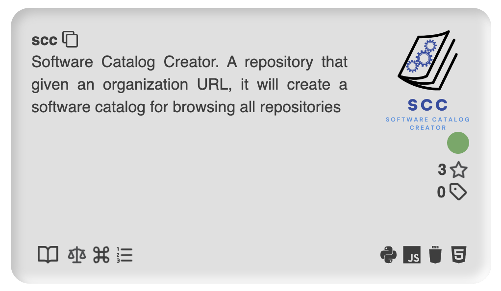

# Software Catalog Creator (soca)

[](https://www.repostatus.org/#active)


A python package that given an organization/user name, it will create a software catalog for browsing all repositories or just a single repository in a minimalist card.

## Sample result

Click [here](https://oeg-upm.github.io/soca/example/index.html) to see an interactive example generated by using the `oeg-upm` organization as input for SCC.  

Command used:  

```text
scc fetch -i oeg-upm --org -o oeg-upm_repos.csv -na &&
scc extract -i oeg-upm_repos.csv -o oeg-upm_metadata -i4p &&
scc portal -i oeg-upm_metadata -o oeg-upm_portal
```

This is an example of a single card using the command:  

```text
scc card https://github.com/oeg-upm/scc --png
```



## Requirements

* Git
* Python 3.9

## Install from GitHub

```text
git clone https://github.com/dakixr/scc
cd scc
pip install -e .
```

Highly recommended step:  

```text
somef configure
```

And you will be asked to provide the following:

* A GitHub authentication token [**optional, leave blank if not used**], which SOMEF uses to retrieve metadata from GitHub. If you don't include an authentication token, you can still use SOMEF. However, you may be limited to a series of requests per hour. For more information, see [https://help.github.com/en/github/authenticating-to-github/creating-a-personal-access-token-for-the-command-line](https://help.github.com/en/github/authenticating-to-github/creating-a-personal-access-token-for-the-command-line)

* The path to the trained classifiers (pickle files). If you have your own classifiers, you can provide them here. Otherwise, you can leave it blank

## Usage

```text
Usage: scc [OPTIONS] COMMAND [ARGS]...

  SCC (Software Catalog Creator)

  Automatically generates a searchable portal for every repository of an
  organization/s or user/s, which is easy to host.

  Usage:

  1. (fetch) Fetch all repos from the desired organization/s
  2. (extract) Extract all metadata for every repo
  3. (portal) Generate a searchable portal for all the retrieved data

Options:
  -h, --help  Show this message and exit.

Commands:
  card     Create a stand-alone card ready to be embedded in a website
  extract  Fetch and save metadata from introduced repos
  portal   Build a portal with a minimalist design
  fetch    Retrieve all organization/s or user/s repositories
```

In order to use SCC you will need to follow the next steps:  

### 1 - Fetch

First thing to do is gather all repositories pointers that we want to use. We'll use the `fetch` command to ease this task.

```text
  -i, --input <name-or-path>  Organization or user name  [required]
  -o, --output <path>         Output csv file  [default: repos.csv]
  --org                       Extracting from a organization  [default: True]
  --user                      Extracting from a user  [default: False]
  -na, --not_archived         Fetch only repos that are not archived
                              [default: False]
  -nf, --not_forked           Fetch only repos that are not forked  [default:
                              False]
  -nd, --not_disabled         Fetch only repos that are not disabled
                              [default: False]
  -h, --help                  Show this message and exit.
```

Is important to determine if the name belongs to a user or a organization by using the --user or --org flag, additionally you can specify an output path with the flag -o.

Example:  

`scc fetch -i dakixr --user`  
`scc fetch -i oeg-upm --org -o oeg-upm_repos.csv --not_archived`  

This command also accepts a file as input (names separated by a new-line) for ingesting multiple names at a time.  

Example:  
`scc fetch -i multiple-users.csv --user -o multiple-users_repos.csv`  
`scc fetch -i multiple-orgs.csv --org -o multiple-orgs_repos.csv --not_archived`  

The output of this command is a csv file with all the repos of the selected users/orgs.
At this moment is a good time to clean this file (remove all repos that you don't want to use).
Note: you can add manually any other repository.

### 2 - Extract

Then we use the `extract` command to extract all the metadata required from each repository. If you want a more in-depth analysis on Python repositories use the flag -i4p or --inspect4py.

```text
  -i, --input <csv-repos>  Pointers to the repositories in csv format
                           [required]
  -o, --output <path>      Dir where repositories metadata will be saved
  -i4p, --inspect4py       Use inspect4py to extract additional metadata from
                           Python repositories
  -h, --help               Show this message and exit.
```

Example:  
`scc extract -i oeg-upm_repos.csv -o oeg-upm_metadata`

### 3 - Portal

This is the last step in the pipeline. For building the portal we need to use the command `portal`, it will take as input the directory created by the command extract.

```text
  -i, --input <dir-json-metadata>
                                  Dir repositories metadata in json format
                                  [required]
  -o, --output <path>             Dir where Software Catalog Portal will be
                                  saved  [default: portal]
  -t, --title <title>             Portal's title  [default: Software Catalog]
  -h, --help                      Show this message and exit.
```

Example:  
`scc portal -i oeg-upm_metadata -o dir_portal --title '[Portal's title]'`

If everything worked fine now a new dir should have been created with all the assets and code to deploy this portal.

### Create a stand-alone card

SCC also gives the option to create a single card in one of two different formats:

* HTML
* PNG

```text
  -i, --input <url>    Repository URL  [required]
  -o, --output <path>  Output file where the html will be saved  [default:
                       card]
  --html               Save card as html  [default: True]
  --png                Save card as a png  [default: False]
  -h, --help           Show this message and exit.
```

As input you will need a github repository url and use one of the flags: --html or --png.  
Note: if no flag is used the default is html.  

Example:  
`scc card -i https://github.com/oeg-upm/scc --html`  
`scc card -i https://github.com/oeg-upm/scc --png`

### Styling the portal

In case you want to change the default style of the portal, SCC decouples the .css files from the code-base. So in the resulting portal directory there will be two .css files are available for further tinkering and styling to everyone needs.
