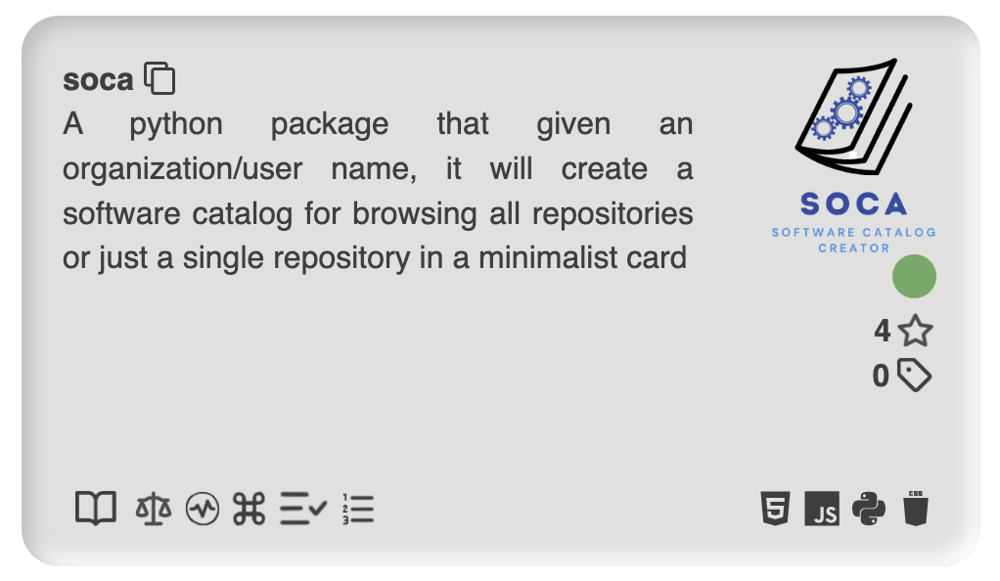
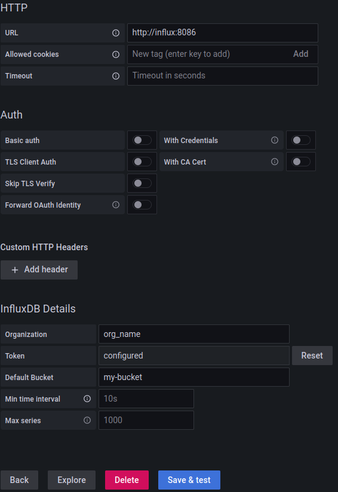
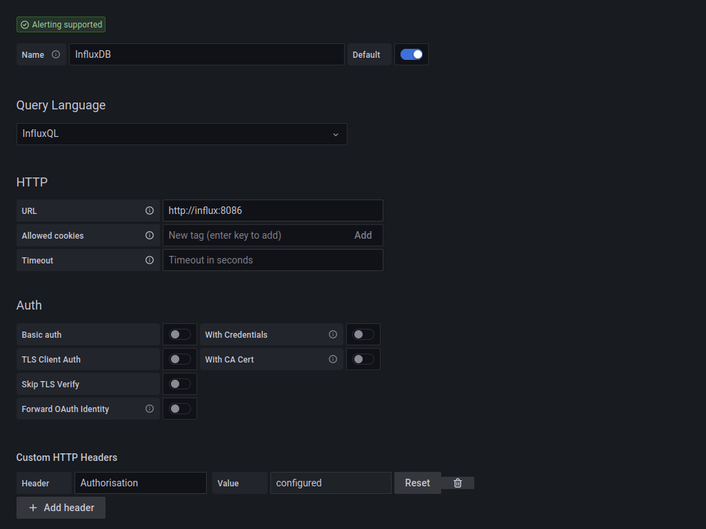
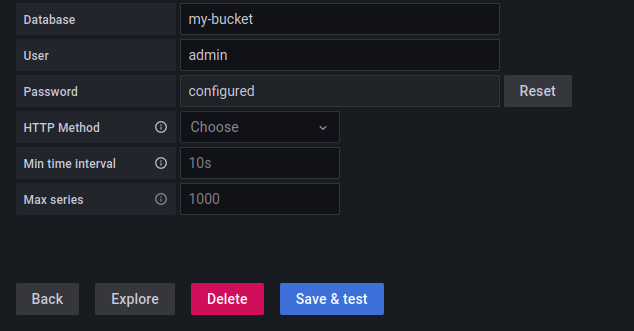

# Software Catalog Creator (soca)

[](https://zenodo.org/badge/latestdoi/402041422) [](https://badge.fury.io/py/soca) [](https://www.repostatus.org/#active)


A python package that given an organization/user name, it will create a software catalog for browsing all repositories or just a single repository in a minimalist card.

## Sample result

Click [here](https://oeg-upm.github.io/soca/example/oeg-upm/index.html) to see an interactive example generated by using the `oeg-upm` organization as input for SOCA.  

Click [here](https://oeg-upm.github.io/soca/example/KnowledgeCaptureAndDiscoveryANDmintproject/index.html) to see an interactive example generated by using the `KnowledgeCaptureAndDiscovery` and `mintproject` organization as input for SOCA.  

Click [here](https://oeg-upm.github.io/soca/example/LinkedEarth/index.html) to see an interactive example generated by using the `LinkedEarth` organization as input for SOCA.  

Command used:  

```text
soca fetch -i oeg-upm --org -o oeg-upm_repos.csv -na &&
soca extract -i oeg-upm_repos.csv -o oeg-upm_metadata -i4p &&
soca portal -i oeg-upm_metadata -o oeg-upm_portal
```

This is an example of a single card using the command:  

```text
soca card https://github.com/oeg-upm/soca --png
```



## Requirements

* Git
* Python 3.9

## Install from GitHub

```text
git clone https://github.com/oeg-upm/soca
cd soca
pip install -e .
```
Highly recommended steps:  

```text
somef configure
```
Alternatively you may run the _installer.sh_ file which will also configure SOMEF, just edit it to it for your needs.

And you will be asked to provide the following:

* A GitHub authentication token [**optional, leave blank if not used**], which SOMEF uses to retrieve metadata from GitHub. If you don't include an authentication token, you can still use SOMEF. However, you may be limited to a series of requests per hour. For more information, see [https://help.github.com/en/github/authenticating-to-github/creating-a-personal-access-token-for-the-command-line](https://help.github.com/en/github/authenticating-to-github/creating-a-personal-access-token-for-the-command-line)

* The path to the trained classifiers (pickle files). If you have your own classifiers, you can provide them here. Otherwise, you can leave it blank

### InfluxDB setup
For SOCA-Dash to work you will need to have a working version of influx 2.+ as well as grafana on your machine. SOCA-Dash needs two datasources and requires tokens to be able to access the influxDB datasources.
For more information please visit: https://docs.influxdata.com/influxdb/cloud/reference/cli/influx/auth/create/

To generate a token:
```
influx auth create -o [organistation name] --access-all
```

SOCA-Dash requires influxQL datasource connection within grafana. 
To ensure that influx 2.+ allows influxQL queries execute the following:
``` 
influx v1 dbrp create --db [Bucket Name] -rp 0 --bucket-id [Bucket-id]
```
You also need to create a v1 authentication:
```
influx v1 auth create \
  --read-bucket [Bucket-id] \
  --write-bucket [Bucket-id] \
  --username admin
 ```
Once the influx has been setup and token created please ensure that SOCA is using said token. Now is a good time to execute the SOCA configure command. Or edit the ./_installer.sh_ file to your needs and executing the script.

## Install from DockerFile

```text
git clone https://github.com/oeg-upm/soca
cd soca
```
SOCA comes with a _installer.sh_ file which will automatically run the SOCA and SOMEF configure commands. Please edit it in accordance to your needs. 
The _installer.sh_ file is necessary for the docker installation process

```
docker compose up
```
Docker compose up starts the grafana and the influxdb within their own container. It also creates its own network: "socaNet"
You may want to list the containers you have/running:
```
docker ps -a
```
If you wish to access the influx container to generate a token you will first need to enter the container:
```
docker run exec -it [influx container id] /bin/bash
```
This starts an bash shell for the container. Remember, the container must be running at the time of executing this command.

Once within the container you will need to generate a influx token. The following command will generate a token, you may change the token flags to your needs. Once this command returns a token please copy this into the _installer.sh_ file "databaseToken"
For more information please visit: https://docs.influxdata.com/influxdb/cloud/reference/cli/influx/auth/create/

To generate a token:
```
influx auth create -o [organistation name] --access-all
```

SOCA-Dash requires influxQL datasource connection within grafana. 
To ensure that influx 2.+ allows influxQL queries execute the following:
``` 
influx v1 dbrp create --db [Bucket Name] -rp 0 --bucket-id [Bucket-id]
```
You also need to create a v1 authentication:
```
influx v1 auth create \
  --read-bucket [Bucket-id] \
  --write-bucket [Bucket-id] \
  --username admin
 ```
Once the influx has been setup and token copied to _installer.sh_ you may feel free to exit the container.

Now we need to build the SOCA container, please ensure you are within the github directory when executing this command:
Remember, container_run.sh will create a summary for the oeg-upm group, modify to your needs and desires. More information can be found within USAGE
```text
docker build -t [INSERT_NAME] .
```
Once the container has been built you may execute the SOCA container by running the following:
```
docker run -it --network [network influx is running on] [container name]

```
## SOCA-Dash 
Once the grafana, influx and soca have been set up correctly you can create a grafana dashboard by importing SOCA-Dash.json. This will allow you to visualise the Summary being uploaded to the influxDB. 

You will require to have created 2 influxDB datasources, one for flux queries and another for influxQL. The following are two examples on how to do so.


For the token use the one previously created.

For the influxQL follow the example provided below.



Here you can see you must create custom headers. Key being "Authorization" and the key being the same token used for the flux datasource. 



For the login please use the login created during the influx v1 auth create. For the rest add your org_name and bucket name. If you have used the SOCA defaults you can just copy the image

## Usage

```text
Usage: soca [OPTIONS] COMMAND [ARGS]...

  SOCA (Software Catalog Creator)

  Automatically generates a searchable portal for every repository of an
  organization/s or user/s, which is easy to host.

  Usage:
  
  =. (Configure) Create configuration file for database etc
  1. (fetch) Fetch all repos from the desired organization/s
  2. (extract) Extract all metadata for every repo
  3. (portal) Generate a searchable portal for all the retrieved data
  4. (summary) Create a summary from the portal information

Options:
  -h, --help  Show this message and exit.

Commands:
  card        Create a stand-alone card ready to be embedded in a website
  configure   This creates a ~/.soca/configure.ini file
  extract     Fetch and save metadata from introduced repos
  portal      Build a portal with a minimalist design
  fetch       Retrieve all organization/s or user/s repositories
  summary     Create a summary of good practices from portal card data
```

In order to use SOCA you will need to follow the next steps:  

### 1 - Fetch

First thing to do is gather all repositories pointers that we want to use. We'll use the `fetch` command to ease this task.

```text
  -i, --input <name-or-path>  Organization or user name  [required]
  -o, --output <path>         Output csv file  [default: repos.csv]
  --org                       Extracting from a organization  [default: True]
  --user                      Extracting from a user  [default: False]
  -na, --not_archived         Fetch only repos that are not archived
                              [default: False]
  -nf, --not_forked           Fetch only repos that are not forked  [default:
                              False]
  -nd, --not_disabled         Fetch only repos that are not disabled
                              [default: False]
  -h, --help                  Show this message and exit.
```

Is important to determine if the name belongs to a user or a organization by using the --user or --org flag, additionally you can specify an output path with the flag -o.

Example:  

`soca fetch -i dakixr --user`  
`soca fetch -i oeg-upm --org -o oeg-upm_repos.csv --not_archived`  

This command also accepts a file as input (names separated by a new-line) for ingesting multiple names at a time.  

Example:  
`soca fetch -i multiple-users.csv --user -o multiple-users_repos.csv`  
`soca fetch -i multiple-orgs.csv --org -o multiple-orgs_repos.csv --not_archived`  

The output of this command is a csv file with all the repos of the selected users/orgs.
At this moment is a good time to clean this file (remove all repos that you don't want to use).
Note: you can add manually any other repository.

### 2 - Extract

Then we use the `extract` command to extract all the metadata required from each repository. If you want a more in-depth analysis on Python repositories use the flag -i4p or --inspect4py.

```text
  -i, --input <csv-repos>  Pointers to the repositories in csv format
                           [required]
  -o, --output <path>      Dir where repositories metadata will be saved
  -i4p, --inspect4py       Use inspect4py to extract additional metadata from
                           Python repositories
  -h, --help               Show this message and exit.
```

Example:  
`soca extract -i oeg-upm_repos.csv -o oeg-upm_metadata`

### 3 - Portal

This is the last step in the pipeline. For building the portal we need to use the command `portal`, it will take as input the directory created by the command extract.

```text
  -i, --input <dir-json-metadata>
                                  Dir repositories metadata in json format
                                  [required]
  -o, --output <path>             Dir where Software Catalog Portal will be
                                  saved  [default: portal]
  -t, --title <title>             Portal's title  [default: Software Catalog]
  -fi, --favicon <path-icon.ico>  Portal's favicon  [default: img/soca-
                                  logo.ico]
  -h, --help                      Show this message and exit.
```

Example:  
`soca portal -i oeg-upm_metadata -o dir_portal --title '[Portal's title]'`

If everything worked fine now a new dir should have been created with all the assets and code to deploy this portal.

### Summary
SOCA now allows to produce a summary json of a given cards_data.json created by the previous portal step.
User must decide whether or not to upload (default = false), or to create JSON file for output summary
For building the summary we need to use the command `summary`
```
  -i, --input <dir-json-metadata>
                                  Dir repositories metadata in json format
                                  [required]
  -o, --output <path>             Dir where Software Catalog Portal will be
                                  saved  [default: summary]
  -U, --upload                    Will upload file to influxdb
```
Example
`soca summary -i cards_data.json -o test '`

### Create a stand-alone card

SOCA also gives the option to create a single card in one of two different formats:

* HTML
* PNG

```text
  -i, --input <url>    Repository URL  [required]
  -o, --output <path>  Output file where the html will be saved  [default:
                       card]
  --html               Save card as html  [default: True]
  --png                Save card as a png  [default: False]
  -h, --help           Show this message and exit.
```

As input you will need a github repository url and use one of the flags: --html or --png.  
Note: if no flag is used the default is html.  

Example:  
`soca card -i https://github.com/oeg-upm/soca --html`  
`soca card -i https://github.com/oeg-upm/soca --png`

### Styling the portal

In case you want to change the default style of the portal, SOCA decouples the .css files from the code-base. So in the resulting portal directory there will be two .css files are available for further tinkering and styling to everyone needs.

